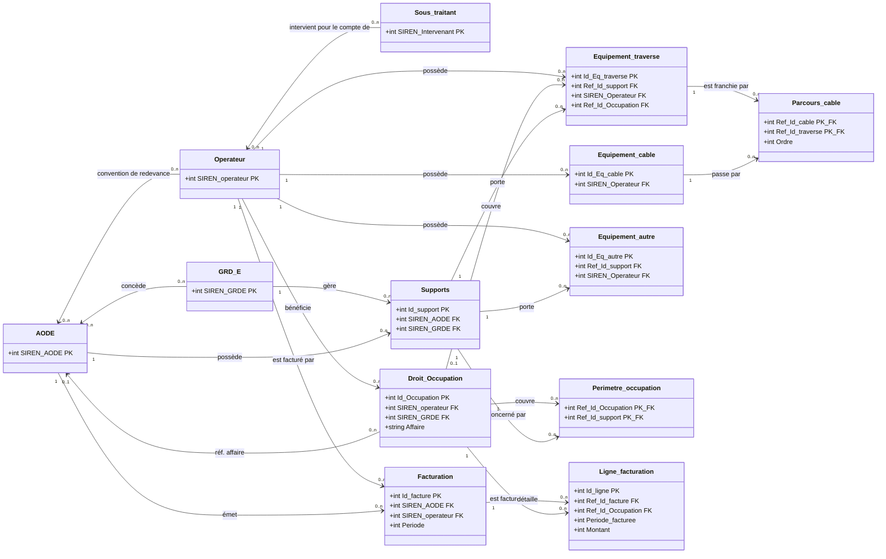

```mermaid

classDiagram
direction LR

class AODE {
    +int SIREN_AODE PK
}

class GRD_E {
    +int SIREN_GRDE PK
}

class Operateur {
    +int SIREN_operateur PK
}

class Sous_traitant {
    +int SIREN_Intervenant PK
}

class Supports {
    +int Id_support PK
    +int SIREN_AODE FK
    +int SIREN_GRDE FK
}

class Equipement_traverse {
    +int Id_Eq_traverse PK
    +int Ref_Id_support FK
    +int SIREN_Operateur FK
    +int Ref_Id_Occupation FK
}

class Equipement_cable {
    +int Id_Eq_cable PK
    +int SIREN_Operateur FK
}

class Equipement_autre {
    +int Id_Eq_autre PK
    +int Ref_Id_support FK
    +int SIREN_Operateur FK
}

class Parcours_cable {
    +int Ref_Id_cable PK_FK
    +int Ref_Id_traverse PK_FK
    +int Ordre
}

class Perimetre_occupation {
    +int Ref_Id_Occupation PK_FK
    +int Ref_Id_support PK_FK
}

class Droit_Occupation {
    +int Id_Occupation PK
    +int SIREN_operateur FK
    +int SIREN_GRDE FK
    +string Affaire
}

class Facturation {
    +int Id_facture PK
    +int SIREN_AODE FK
    +int SIREN_operateur FK
    +int Periode
}

class Ligne_facturation {
    +int Id_ligne PK
    +int Ref_Id_facture FK
    +int Ref_Id_Occupation FK
    +int Periode_facturee
    +int Montant
}

AODE "1" --> "0..n" Supports : possède
AODE "0..n" <-- "0..n" Operateur : convention de redevance
AODE "0..1" <-- "0..n" Droit_Occupation : réf. affaire
AODE "0..n" <-- "0..n" GRD_E : concède
AODE "1" --> "0..n" Facturation : émet
GRD_E "1" --> "0..n" Supports : gère
Supports "1" --> "0..n" Perimetre_occupation : est concerné par
Supports "1" --> "0..n" Equipement_traverse : porte
Supports "1" --> "0..n" Equipement_autre : porte
Droit_Occupation "1" --> "0..n" Perimetre_occupation : couvre
Droit_Occupation "0..1" --> "0..n" Equipement_traverse : couvre
Droit_Occupation "1" --> "0..n" Ligne_facturation : est facturé via
Operateur "1" --> "0..n" Equipement_traverse : possède
Operateur "1" --> "0..n" Equipement_cable : possède
Operateur "1" --> "0..n" Equipement_autre : possède
Operateur "1" --> "0..n" Droit_Occupation : bénéficie
Operateur "1" --> "0..n" Facturation : est facturé par
Operateur "0..n" <-- "0..n" Sous_traitant : intervient pour le compte de
Equipement_cable "1" --> "0..n" Parcours_cable : passe par
Equipement_traverse "1" --> "0..n" Parcours_cable : est franchie par
Facturation "1" --> "0..n" Ligne_facturation : détaille
```
