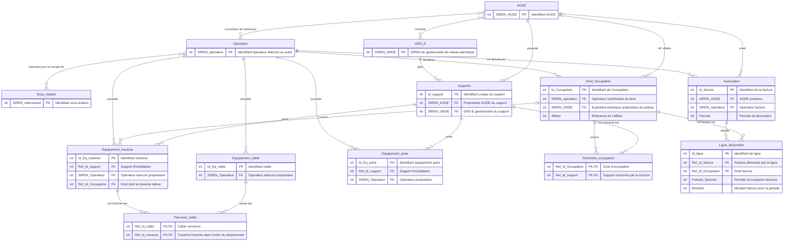

```mermaid

erDiagram

AODE {
int SIREN_AODE PK "Identifiant AODE"
}

GRD_E {
int SIREN_GRDE PK "SIREN du gestionnaire de reseau electrique"
}

Operateur {
int SIREN_operateur PK "Identifiant operateur telecom ou autre"
}

Sous_traitant {
int SIREN_Intervenant PK "Identifiant sous-traitant"
}

Supports {
int Id_support PK "Identifiant unique du support"
int SIREN_AODE FK "Proprietaire AODE du support"
int SIREN_GRDE FK "GRD-E gestionnaire du support"
}

Equipement_traverse {
int Id_Eq_traverse PK "Identifiant traverse"
int Ref_Id_support FK "Support d'installation"
int SIREN_Operateur FK "Operateur telecom proprietaire"
int Ref_Id_Occupation FK "Droit dont la traverse releve"
}

Equipement_cable {
int Id_Eq_cable PK "Identifiant cable"
int SIREN_Operateur FK "Operateur telecom proprietaire"
}

Equipement_autre {
int Id_Eq_autre PK "Identifiant equipement autre"
int Ref_Id_support FK "Support d'installation"
int SIREN_Operateur FK "Operateur proprietaire"
}

Parcours_cable {
int Ref_Id_cable PK, FK "Cable concerne"
int Ref_Id_traverse PK, FK "Traverse franchie dans l'ordre du deploiement"
}

Perimetre_occupation {
int Ref_Id_Occupation PK, FK "Droit d'occupation"
int Ref_Id_support PK, FK "Support concerne par le troncon"
}

Droit_Occupation {
int Id_Occupation PK "Identifiant de l'occupation"
int SIREN_operateur FK "Operateur beneficiaire du droit"
int SIREN_GRDE FK "Exploitant electrique proprietaire du poteau"
int Affaire "Reference de l'affaire"
}

Facturation {
int Id_facture PK "Identifiant de la facture"
int SIREN_AODE FK "AODE emetteur"
int SIREN_operateur FK "Operateur facture"
int Periode "Periode de facturation"
}

Ligne_facturation {
int Id_ligne PK "Identifiant de ligne"
int Ref_Id_facture FK "Facture alimentee par la ligne"
int Ref_Id_Occupation FK "Droit facture"
int Periode_facturee "Periode d'occupation facturee"
int Montant "Montant facture pour la periode"
}

AODE||--o{Supports:"possede"
AODE}o--o{Operateur:"convention de redevance"
AODE|o--o{Droit_Occupation:"réf. affaire"
AODE}o--o{GRD_E:"concède"
AODE||--o{Facturation:"émet"
GRD_E||--o{Supports:"gère"
Supports||--o{Perimetre_occupation:"est concerné par"
Supports||--o{Equipement_traverse:"porte"
Supports||--o{Equipement_autre:"porte"
Droit_Occupation||--o{Perimetre_occupation:"couvre"
Droit_Occupation|o--o{Equipement_traverse:"couvre"
Droit_Occupation||--o{Ligne_facturation:"est facturé via"
Operateur||--o{Equipement_traverse:"possède"
Operateur||--o{Equipement_cable:"possède"
Operateur||--o{Equipement_autre:"possède"
Operateur||--o{Droit_Occupation:"bénéficie"
Operateur||--o{Facturation:"est facturé par"
Operateur}o--o{Sous_traitant:"intervient pour le compte de"
Equipement_cable||--o{Parcours_cable:"passe par"
Equipement_traverse||--o{Parcours_cable:"est franchie par"
Facturation||--o{Ligne_facturation:"détaille"
```
